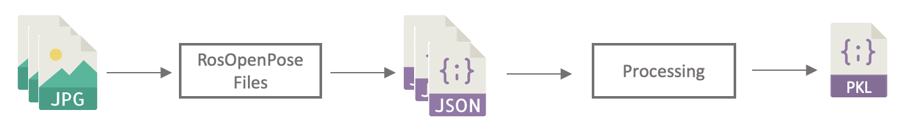
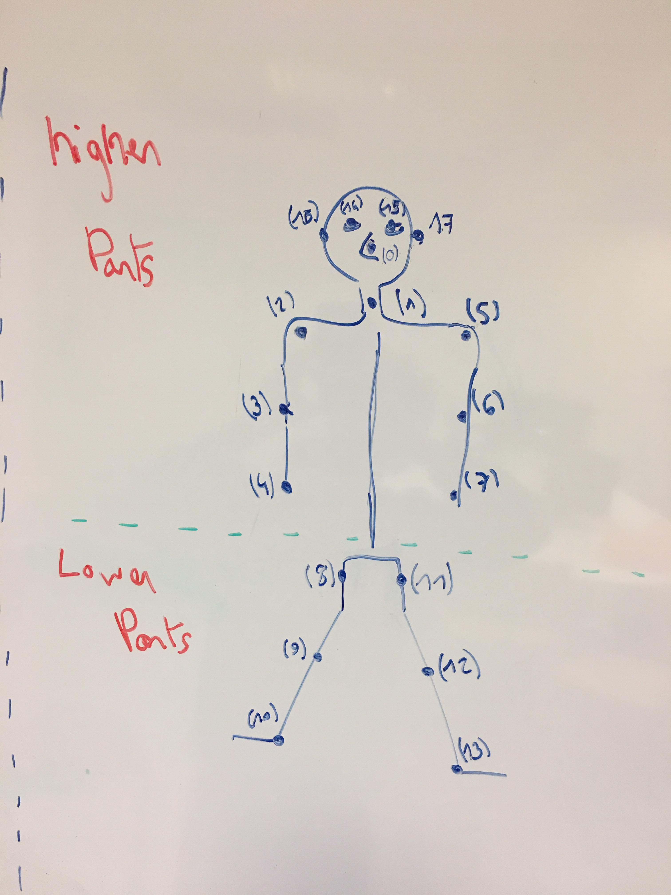
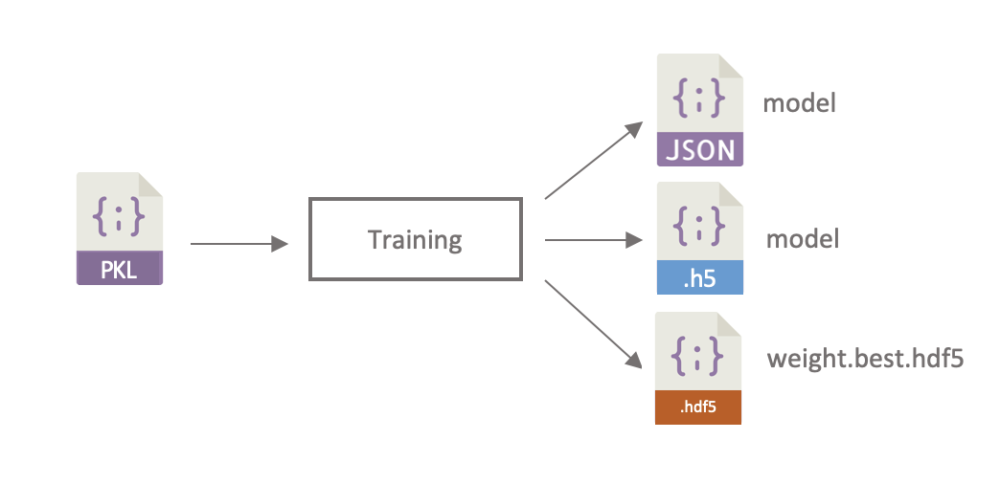
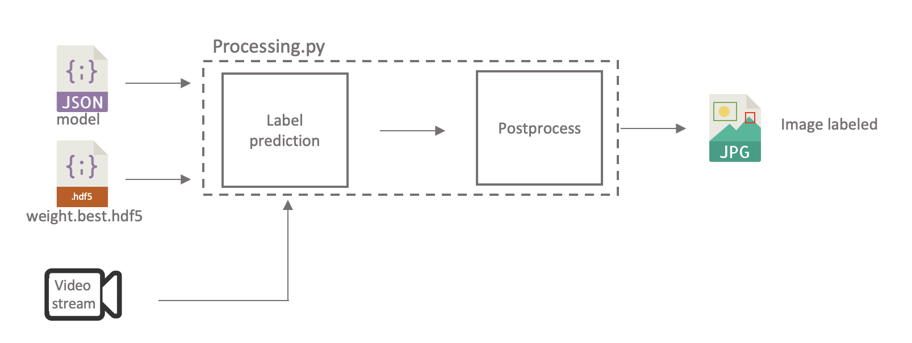

In this file, you will find some explanation of how to add new data in the dataset, process them, train the model, save it to be usable, predict and evaluate the model.

# How to add new images in the dataset?

The dataset is composed of images following this structure:

<pre>
imageDataset
      |------------ google
      |               |------------ focus
      |               |------------ distract
      |------------ perso
                      |------------ focus
                      |------------ distract
</pre>

The first folder level (`google` / `perso`) was organised in that manner to train with different proportion of images comming from internet with respect to private images. But this feature was not implemented.

In order to make it work, you have to keep the same structure.
The labelisation is coming from the repartition between the `focus` and the `distract` folder.

In order to add new images in the dataset, just respect the structure:

- Add images coming from internet in the `google` directory and private image in the `perso` directory

- Add images in the right folder depending on their label, for instance if all the person in the image are focus, add it in the `focus` folder and respectively

Most of the time, images have very different names. If you want to rename them all, you can use the program `processing/utils.py` with one argument. This program is running on **python 3 only** since it uses `glob` to recursively get all the images in subdirectories.

```
$ python3 processing/utils.py [folder_path] [--mask]
```

**Beware, there are no security when renaming the images, if the name is already taken it will erase the previous file.** By using a mask, your images will have the following name template `ìmg_[mask]_N` with `N` in the range 0 to maximum images number.

### Example:

- Command:

```
$ python3 processing/utils.py ../imageDataset/ --mask 999999
```

- Output:

<pre>
imageDataset
    |------------ google
    |               |------------ focus
    |               |               |---- img_999999_0.jpg
    |               |               |---- img_999999_1.png
    |               |               |---- ...
    |               |------------ distract
    |------------ perso
                    |------------ focus
                    |------------ distract
</pre>

Once you get there you should have your full image dataset ready to be process.

# How to process your dataset to be ready for training?

At this step we suppose you have an image dataset folder following the right structure (see above). The name of this folder is `imageDataset` by default but you can change it if you want.

Now let's detect the human pose of these images. Since we are using relative path, all the program have to be executed from the main folder `DeepPoseIdentification/`

The processing block pursues the following diagram :



### 1. Activate the Ros service of OpenPose with:

See https://github.com/ildoonet/ros-openpose for more information about how to install it and how to run it.

```
$ roslaunch openpose_ros_node videostream.launch
```

### 2. Then run the program `processing/RosOpenPoseFiles.py`:

```
$ python processing/RosOpenPoseFiles.py [--input] [--output]
```

- `--input`: Path to the folder containing the image dataset.

- `--output`: Path to the output folder where the json files will be created. **This folder need to be created before running this program.**

### Example:

- Command:

```
$ python processing/RosOpenPoseFiles.py --input ../imageDataset/ --output ../openPoseDataset/
```

- Output:

<pre>
openPoseDataset
    |------------ google
    |               |------------ focus
    |               |               |---- img_999999_0.json
    |               |               |---- img_999999_1.json
    |               |               |---- ...
    |               |------------ distract
    |------------ perso
                    |------------ focus
                    |------------ distract
</pre>

**Beware, do not forget the `"/"` at the end of each path**

At this point, you will have a new folder dataset named `openPoseDataset` by default. This folder should contain the same structure but for each images in `imageDataset`, it will have a json file of the same name. Each json file will be an array of the resulting joints (human pose) for each person present in the image.

Here is an example of the structure of a json file for an image containing few people:

<pre>
[{
  'body_part': [{
    'x': 125
    'y': 453
    'confidence': 0.35213232321342
    'part_id': 0
  },
  { ... },
  ...],
  'face_landmark': [],
  'image_size': { 'width': 350, 'height': 600}
}, {...}]
</pre>

Originaly there are 18 body parts as you can see in the following image.



### 3. In order to process the json dataset, run the python script `processing/processing.py`

**Use python 3 only** to run this script since it uses `glob` also.

```
$ python3 processing/processing.py [--path] [--discardLowBodyPart]
```

- `--path`: Path to the folder containing the joints position as json files.

- `--discardLowBodyPart`: Flag indicating the lower joints (cf. image above) to discard from the features. By default this flag is false which means it will take all the joints.

### Example:

- Command:

```
$ python processing/processing.py --path ../openPoseDataset/
```

- Output:

<pre>
Create an openPoseDataset.pkl file
</pre>

This processing step will create a pickle file (with the same name as the input json folder) containing the input data matrix previously normalised ready to feed the neural network.

<pre>
Input data matrix:
                                {54 number of features}
            |--------------------------------------------------------------|
            |       Nose          Neck                          Left ear
            |   x0  y0  c0  |   x1  y1  c1  |    ...    |   x17  y17  c17  |  source  |   label  |
Person 0    |   .   .   .   |   .   .   .   |           |    .    .    .   |    .     |     .    |
Person 1    |   .   .   .   |   .   .   .   |           |    .    .    .   |    .     |     .    |
   .        |   .   .   .   |   .   .   .   |           |    .    .    .   |    .     |     .    |
   .        |   .   .   .   |   .   .   .   |           |    .    .    .   |    .     |     .    |
   .        |   .   .   .   |   .   .   .   |           |    .    .    .   |    .     |     .    |
Person N    |   .   .   .   |   .   .   .   |           |    .    .    .   |    .     |     .    |
</pre>

Joint positions object:

- `x`: X-axis coordinate corresponding to the pixel number normalised by the width of the image.

- `y`: Y-axis coordinate corresponding to the pixel number normalised by the height of the image.

- `c`: Confidence on the point which correspond to the probability to being at this specific position.

`source`:

- 0 -> Images coming from internet
- 1 -> Private images

`label`:

- 0 -> Person focus
- 1 -> Person distract

# How to train your model and save it?

The training step follows the diagram below:



Once the pickle file is created from the processing step, the training can be run:

```
$ python training/training.py [--path] [--epochNb] [--layerNb]
```

- `--path`: Path to the openPose dataset pickle file created by the processing step ("./openPoseDataset.pkl" by default).

- `--epochNb`: The number of epoch you want your network to learn (1000 by default).

- `--layerNb`: The number of hidden layer which compose your network (5 by default).

### Example:

- Command:

```
$ python training/training.py --path ./inputMatrix.pkl --epochNb 2000 --layerNb 2
```

- Output:

<pre>
Model trained and saved as `model.json`, `model.h5` and `weights.best.hdf5`.
</pre>

Once you get there, the model will be saved as `model.json`, `model.h5` and the best weights for loss optimisation will be saved as `weights.best.hdf5`. **All these files will be saved in the root directory from where you ran the python program. We suggeste you should always run all the process from the root folder `DeepPoseIdentification/`**

Also, a pickle file named `data_test.pkl` is created with the testing data (ratio of 20% of the whole dataset). This file can be use in the prediction step to evaluate the performance of your model.

# How to display learning metrics with TensorBoard?

After the training step, if you want to gain some insight, just run:

```
$ tensorboard --logdir="tensorboard/keras_model/[date of learning]"
```

And open your browser on `http://localhost:6006/`, you will be able to see all the metrics of the neural network learning.

# How to use your trained model to predict testing data?

The prediction step follows the diagram below:



The model will be loaded from the `model.json` file and the weigths will be set following the `weights.best.hdf5` file.
This python script requieres the `data_test.pkl` file. **As said before, these files are saved during the training step, so make sure there are present in the folder from where you are running the python script.**

Simply run the following command:

```
$ python predictions/prediction.py
```

# How to use your trained model to predict a real time video stream?

First activate the video stream ros service to send the stream on a channel using the command:

```
$ roslaunch openpose_ros_node videostream.launch
```

In the other hand, run the python script with ROS to subscribe to the video stream with the command:

```
$ rosrun openpose_ros_examples dataProcessingMainNode.py
```

The model will be loaded from the `model.json` file and the weigths will be set following the `weights.best.hdf5` file. **Make sure you are running this python script from the same folder where these files are present.**

If you want to display the video stream in real time, you can also run the following command:

```
rosrun rqt_image_view rqt_image_view
```
